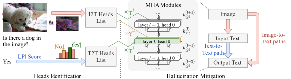

# EntroGraph / EG-MHCD-AE

This repository implements EntroGraph-guided Multi-Hypothesis Contrastive
Decoding with Answer Entropy for LVLM hallucination mitigation.

The current main pipeline focuses on Qwen2.5-VL + POPE / COCO val2014 and
includes:

- label-level EntroGraph Contrastive Decoding for yes/no hallucination probing
- token-level positive/negative contrastive decoding
- SINDex-style semantic clustering
- Answer Entropy reranking with visual dependency scores

This codebase is built on top of legacy AllPath-related code. Legacy files are
retained for comparison and attribution, but the current experimental pipeline
is under `src/` and `main.py`.

## Environment

Use a Python environment with PyTorch, Transformers, Pillow, NumPy, and pytest.
For Qwen2.5-VL runs, install the model dependencies recommended by the Qwen2.5-VL
release, including `qwen-vl-utils`.

```bash
pip install torch transformers pillow numpy pytest qwen-vl-utils
```

The repository does not patch `transformers` and does not modify the legacy
`mods/` model code for EntroGraph experiments.

## Dataset layout

Set COCO val2014 through the CLI or environment variable:

```bash
export COCO_IMAGE_ROOT=/path/to/coco/val2014
```

Expected POPE files:

```text
benchs/pope/coco/coco_pope_random.jsonl
benchs/pope/coco/coco_pope_popular.jsonl
benchs/pope/coco/coco_pope_adversarial.jsonl
```

`main.py` accepts either one JSONL file or a directory. When a directory is
provided, `--split {random,popular,adversarial,all}` controls which POPE split
files are loaded.

## Quick debug command

```bash
bash scripts/debug_eg_label_cd_20.sh
bash scripts/debug_eg_mhcd_ae_20.sh
```

Equivalent single-command label-level debug:

```bash
python3 main.py \
  --dataset benchs/pope/coco/coco_pope_random.jsonl \
  --coco-image-root "$COCO_IMAGE_ROOT" \
  --method eg_label_cd \
  --output-dir outputs/debug \
  --trace-dir outputs/debug/traces \
  --neg-type gaussian \
  --neg-std 0.2 \
  --seed 42 \
  --limit 20
```

## POPE full run command

Run the P0-stable POPE methods on random / popular / adversarial:

```bash
bash scripts/run_pope_v21.sh
```

Evaluate saved outputs:

```bash
bash scripts/eval_pope_outputs.sh
```

`eg_mhcd_ae` is intentionally kept out of the full POPE script until the debug
20-sample run passes for the target environment.

## Method list

- `eg_label_cd`: POPE yes/no label-level EntroGraph contrastive scoring.
- `token_cd`: true token-level positive/negative contrastive decoding.
- `eg_mhcd_ae`: EG-CD multi-candidate generation plus SINDex / Answer Entropy
  / EntroGraph reranking.
- `greedy`: standard model generation baseline.
- `label_pos`: positive-branch yes/no label logprob baseline.
- `vcd_label_const`: label-level contrastive scoring with constant alpha.
- `sample_majority`: legacy multi-sample majority logic kept for comparison.

## Output schema

Every result item contains:

```json
{
  "question_id": "...",
  "image_name": "...",
  "image_path": "...",
  "question": "...",
  "ground_truth": "yes",
  "method": "eg_label_cd",
  "best_answer": "yes"
}
```

`eg_label_cd` adds yes/no label logprobs, CD scores, label entropy, JS
divergence, dynamic alpha, risk, and negative branch metadata:

```json
{
  "scores_pos": {"yes": 0.0, "no": 0.0},
  "scores_neg": {"yes": 0.0, "no": 0.0},
  "scores_cd": {"yes": 0.0, "no": 0.0},
  "H_label": 0.0,
  "JS_label": 0.0,
  "alpha": 0.0,
  "risk": 0.0,
  "neg_type": "gaussian"
}
```

`token_cd` adds token ids, contrastive entropy, visual divergence, risk and
grounding aliases, average CD logprob, and decode config:

```json
{
  "text": "...",
  "token_ids": [],
  "H_pos": 0.0,
  "H_cd": 0.0,
  "D_vis": 0.0,
  "D_vis_norm": 0.0,
  "S_graph": 0.0,
  "risk_graph": 0.0,
  "grounding_score": 0.0,
  "avg_logprob_cd": 0.0,
  "config": {}
}
```

`eg_mhcd_ae` adds all candidates, SINDex / Answer Entropy scores, uncertainty
mode, and final rerank metadata:

```json
{
  "all_candidates": [],
  "H_cluster": 0.0,
  "delta_AE": 0.0,
  "best_index": 0,
  "worst_index": 0,
  "candidate_scores": [],
  "risk_high": false,
  "final_scores": [],
  "mode": "eg_answer_entropy"
}
```

Token traces are written separately under:

```text
outputs/traces/{method}/{dataset}/{question_id}.jsonl
```

## Known limitations

- `token_cd` currently prioritizes correctness and may recompute full inputs at
  each step if model cache reuse is not available.
- `eg_mhcd_ae` should be debugged on `--limit 20` before long full-split runs.
- Stage-1 does not include GNN, GroundingDINO, or T2I negative branches.
- `S_graph` is a hallucination risk alias: `H_cd - D_vis_norm`.
- Legacy AllPath scripts remain available for reference, but EntroGraph v2.x
  experiments should use `src/` modules through `main.py`.

## Legacy code attribution

### AllPath

This is the official PyTorch implementation for our **NeurIPS 2025** paper:

> **Intervene-All-Paths: Unified Mitigation of LVLM Hallucinations across Alignment Formats**  
> \> Jiaye Qian<sup>1,2*</sup>&emsp; Ge Zheng<sup>2*</sup>&emsp; Yuchen Zhu<sup>2</sup>&emsp; Sibei Yang<sup>1†</sup>  
> \> <sup>1</sup>School of Computer Science and Engineering, Sun Yat-sen University &emsp;<sup>2</sup>ShanghaiTech University



[](https://arxiv.org/abs/2511.17254)

## Abstract

Despite their impressive performance across a wide range of tasks, Large Vision-Language Models (LVLMs) remain prone to hallucination. In this study, we propose a comprehensive intervention framework aligned with the transformer’s causal architecture in LVLMs, integrating the effects of different intervention paths on hallucination. We find that hallucinations in LVLMs do not arise from a single causal path, but rather from the interplay among image-to-input-text, image-to-output-text, and text-to-text pathways. For the first time, we also find that LVLMs rely on different pathways depending on the question–answer alignment format. Building on these insights, we propose simple yet effective methods to identify and intervene on critical hallucination heads within each pathway, tailored to discriminative and generative formats. Experiments across multiple benchmarks demonstrate that our approach consistently reduces hallucinations across diverse alignment types.

## Setup

### Environment Setup

Our codebase requires Python ≥ 3.9. When running evaluations, each model family depends on a specific version of the `transformers` library. Since the `transformers` API changes over time, using a different version may lead to unexpected issues. To avoid this, several modules include version checks to ensure the correct environment is used. The required versions are:

| Model     | `transformers` Version |
| --------- | ---------------------- |
| LLaVA 1.5 | 4.37.2                 |
| Qwen VL   | 4.32.0                 |

We recommend setting up the environment according to the official instructions provided by each model’s GitHub repository.

In addition, please install the following dependencies:

```bash
pip install nltk pycocotools
```

### Path Setup

You will need to configure the paths in [`playground/path_table.py`](playground/path_table.py) by replacing each `path/to/xxx` placeholder with the actual locations on your system.

#### COCO

To evaluate CHAIR, you should download the COCO dataset from their [official website](https://cocodataset.org/).

After downloading, please set `COCO Path` to the `val2014/` directory that directly contains the image files, and set `COCO annotation` to the corresponding `instances_val2014.json` file.

#### MME

To evaluate MME, you should download the MME dataset from [this link](https://huggingface.co/datasets/darkyarding/MME/blob/main/MME_Benchmark_release_version.zip).

After downloading, you should unzip this file, and set `MME root` to the `MME_Benchmark_release_version/MME_Benchmark/` folder in this file.

#### GQA

To evaluate GQA, you should download the images from GQA from [this website](https://cs.stanford.edu/people/dorarad/gqa/download.html).

After downloading, you should unzip this file and set `GQA path` to the folder that **directly** contains the GQA images.

## MCQ POPE

Our method includes a dataset called **MCQ POPE**, which can be found in the `benchs/mcq_pope/` directory. Files beginning with `resampled` are the datasets we use for extracting attention heads. These files contain no images that overlap with the final evaluation datasets.

## Heads Identification

Our approach consists of two components: (1) heads identification and (2) hallucination mitigation. If you want to proceed directly to evaluation, we have already provided the identified heads in the `head_ours/` directory.

### File Structure

For each model, the extracted heads on different datasets are stored in
`head_ours/[model name]/heads-[benchmark name]-{format|image}.jsonl`.
Here, `format` indicates T2T heads, and `image` indicates I2T heads.

Each line in the file follows the format:

```
[[layer id, head id], I2T/T2T score]
```

The entries are sorted in ascending order by I2T/T2T score, meaning that heads appearing earlier in the file are more likely to promote hallucinations.

### How to Reproduce

To reproduce the extracted attention heads, you will need to run one of the extraction scripts and specify the model and benchmark. Here’s a structured overview:

- **Scripts**

  - `inference_t2t_scores.py` – extracts T2T heads
  - `inference_i2t_scores.py` – extracts I2T heads

- **Model (`--model`)**

  - `llava` – LLaVA v1.5 7B
  - `qwenvl` – Qwen VL

- **Benchmark (`--eval`)**

  - `ResampledPOPE`
  - `ResampledMCQPOPE`
  - `ResampledCHAIR`

> Benchmarks prefixed with `Resampled` ensure that the dataset used for head extraction does **not** overlap with the dataset used for final evaluation.

- **Dataset and Split (only for POPE/MCQ POPE)**

  - `--dataset coco`
  - `--split` can be `random`, `popular`, or `adversarial`

For example, to extract T2T heads from LLaVA on the MCQ POPE dataset using the adversarial split:

```bash
python inference_t2t_scores.py \
    --model llava \
    --eval ResampledPOPE \
    --dataset coco \
    --split adversarial
```

If you want to extract heads for the CHAIR benchmark, the `--dataset` and `--split` arguments are not needed. For example:

```bash
python inference_t2t_scores.py \
    --model llava \
    --eval ResampledCHAIR
```

## Evaluation

### POPE / MCQ POPE

To evaluate on the POPE or MCQ POPE benchmarks, you need to specify the following:

- **Model (`--model`)**: choose which model to evaluate

  - `llava` – LLaVA v1.5 7B
  - `qwenvl` – Qwen VL

- **Method (`--method`)**: choose the evaluation method

  - `baseline` – vanilla model evaluation
  - `vcd` – Visual Contrastive Decoding
  - `icd` – Instruction Contrastive Decoding
  - `pai` – Paying More Attention to Image
  - `adhh` – Countering Description Contrastive Decoding
  - `allpath` – our proposed method

- **Benchmark (`--eval`)**:

  - `pope` – POPE benchmark
  - `mcqpope` – MCQ POPE benchmark

- **Dataset and split (`--dataset` and `--split`)**

  - `--dataset` can be `coco`, `aokvqa`, or `gqa`
  - `--split` can be `random`, `popular`, or `adversarial`

- **Sampling (`--sample`)**: enables `temperature=1.0`, which is the setting reported in our paper. You can also specifying the temperature by passing `--temperature <float>`

For example, to evaluate LLaVA on the MCQ POPE benchmark using our method and the adversarial split:

```bash
python main.py \
    --model llava \
    --method allpath \
    --sample \
    --eval mcqpope \
    --dataset coco \
    --split adversarial
```

### CHAIR

To evaluate on the CHAIR benchmark, use the `--fixed True` flag to run evaluation on a fixed set of 500 questions instead of randomly sampling them.

For example, to evaluate LLaVA using our method on CHAIR:

```bash
python main.py \
    --model llava \
    --method allpath \
    --eval chair \
    --fixed True
```

### MME

Evaluating on the MME benchmark does not require any additional parameters.

For example, to run LLaVA with our method on MME:

```bash
python main.py \
    --model llava \
    --method allpath \
    --eval mme \
    --sample
```

## Acknowledgements

Our implementation incorporates or modifies code from the following open-source repositories. We extend our sincere gratitude to the authors of these projects (listed in no particular order):
- [BradyFU/Awesome-Multimodal-Large-Language-Models](https://github.com/BradyFU/Awesome-Multimodal-Large-Language-Models/tree/Evaluation)
- [TianyunYoung/Hallucination-Attribution](https://github.com/TianyunYoung/Hallucination-Attribution)
- [hillzhang1999/ICD](https://github.com/hillzhang1999/ICD)
- [haotian-liu/LLaVA](https://github.com/haotian-liu/LLaVA)
- [LALBJ/PAI](https://github.com/LALBJ/PAI)
- [QwenLM/Qwen-VL](https://github.com/QwenLM/Qwen-VL)
- [huggingface/transformers](https://github.com/huggingface/transformers)
- [DAMO-NLP-SG/VCD](https://github.com/DAMO-NLP-SG/VCD)

## Citation

If you find our work useful, please cite us as:

```bib
@inproceedings{qian2025interveneallpaths,
    title     = {Intervene-All-Paths: Unified Mitigation of {LVLM} Hallucinations across Alignment Formats},
    author    = {Qian, Jiaye and Zheng, Ge and Zhu, Yuchen and Yang, Sibei},
    booktitle = {The Thirty-ninth Annual Conference on Neural Information Processing Systems},
    year      = {2025},
    url       = {https://openreview.net/forum?id=HRBhNqkG03}
}
```
